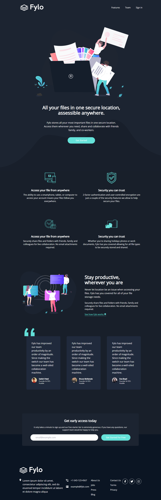

# Fylo Website

Fylo landing page with dark/light mode switcher from my Tailwind course (Tailwind CSS From Scratch | Learn By Building Projects ) and from Frontend Mentor Challenge

fontFamily: {
sans: ["Raleway", "sans-serif"],
opensans: ["Open Sans", "sans-serif"],
},

colors: {
darkBlue: "hsl(217, 28%, 15%)",
darkBlue1: "hsl(218, 28%, 13%)",
darkBlue2: "hsl(216, 53%, 9%)",
darkBlue3: "hsl(219, 30%, 18%)",
accentCyan: "hsl(176, 68%, 64%)",
accentBlue: "hsl(198, 60%, 50%)",
lightRed: "hsl(0, 100%, 63%)",
},

This site has a dark and light mode styling and an icon button to toggle between the different modes, javascript was used to effect such switch on toggle

Navbar: we have the menus, the logo and the dark mode switcher and they stack on each on other on small screens

Hero Section: This section contains an image and a description with a button that scales on hover. These content all stacks on all screen sizes

Features Section: Contains four items, and each item contains images and descriptive contents that are stacked. The items were positioned using flex and it contains two items in a row

Productive Section: An image and a descriptive content and a link, they stack on small screens but are aligned on same row on medium screens and above

Testimonials: This section is made up of three boxes, and each box contains a description and image (small in size and rounded). These boxes are stacked on small screens but are in a row on larger screens

Early Access Section: This section contains description and then the input & button.

Footer: contains the logo, menus and social media icons

## Usage

Install dependencies

```
npm Install
```

Run Tailwind CLI

```
npm run watch
```


